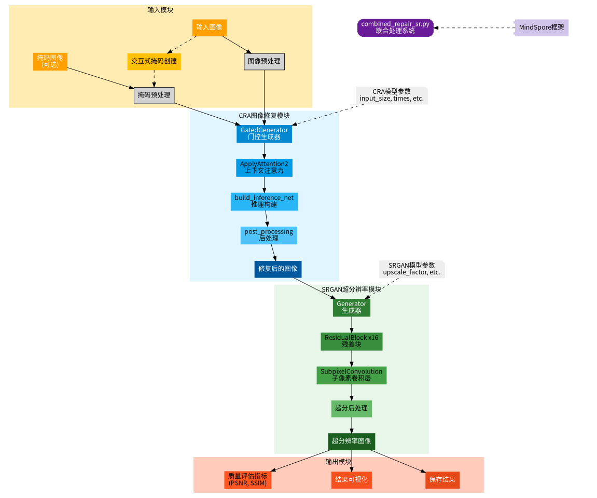
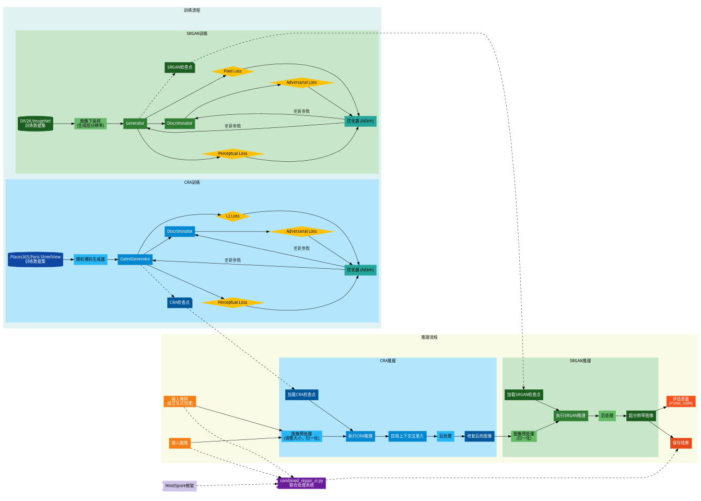
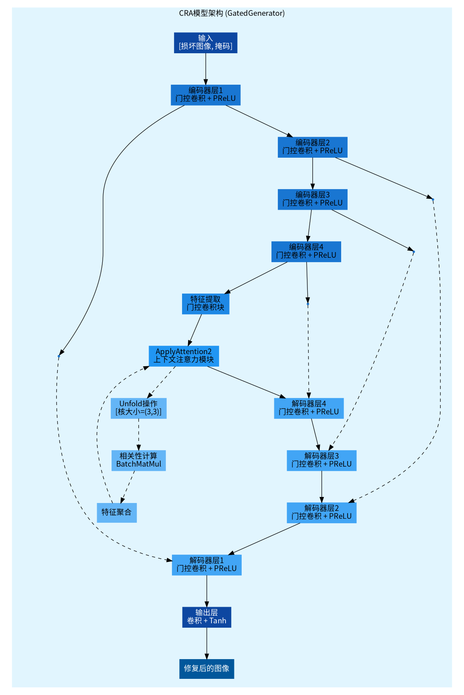
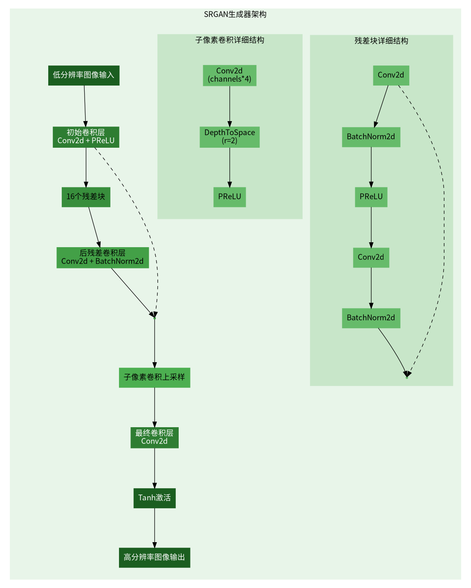
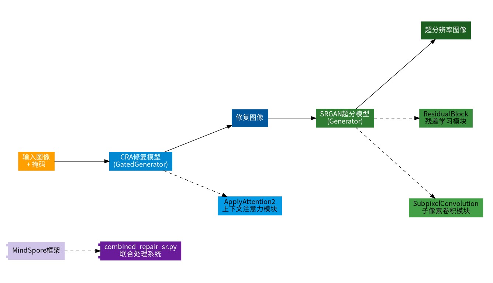
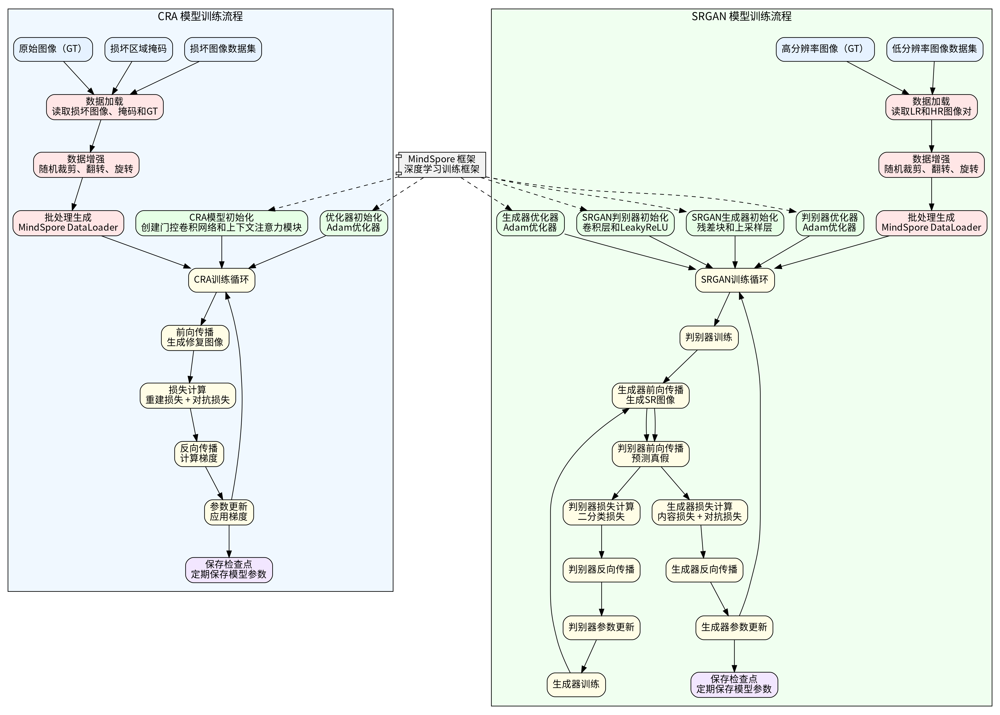
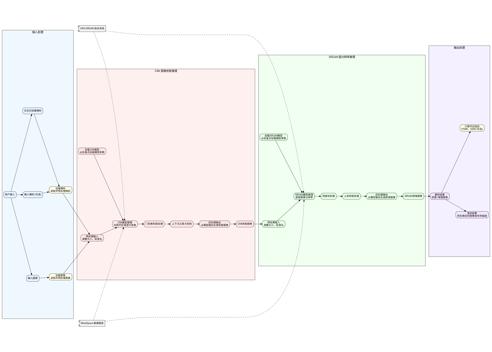
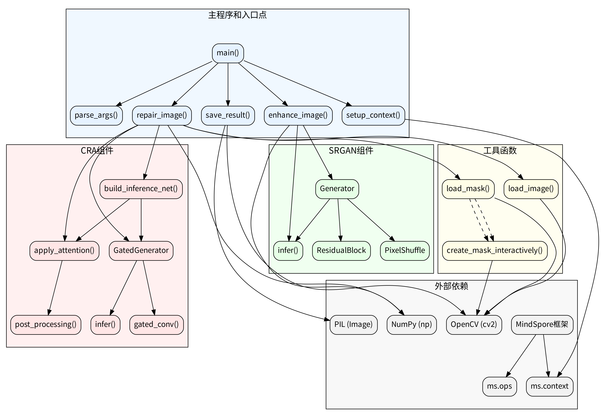
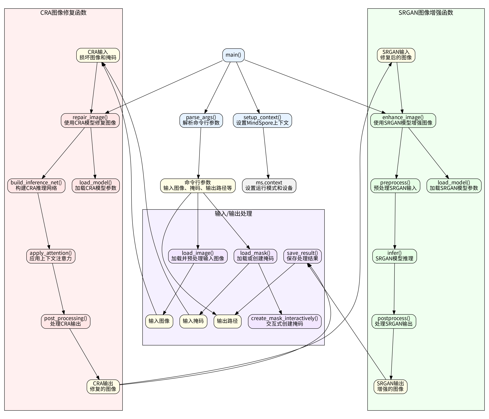

# CRA与SRGAN项目架构图摘要

本文档提供了项目中生成的所有架构图的概览。

## 项目总体架构图

**文件名**: 项目总体架构图.png (97.4 KB)

展示CRA和SRGAN模块之间的关系和数据流，包含输入模块、处理模块和输出模块。

## 数据流图

**文件名**: 数据流图.png (113.3 KB)

详细展示了训练和推理过程中的数据流动，分别展示了CRA和SRGAN的训练和推理流程。

## CRA模型架构图

**文件名**: CRA模型架构图.png (163.5 KB)

详细展示了CRA (上下文残差聚合) 模型的内部结构，包含门控卷积网络和上下文注意力机制。

## SRGAN模型架构图

**文件名**: SRGAN模型架构图.png (98.9 KB)

详细展示了SRGAN生成器的内部结构，包含残差块和子像素卷积上采样。

## 组合架构总览图

**文件名**: 组合架构总览图.png (70.2 KB)

简洁地展示了CRA和SRGAN如何组合工作。

## 数据预处理和模型训练流程图

**文件名**: 数据预处理和训练流程图.png (738.0 KB)

展示了数据预处理步骤和模型训练流程，包括数据增强、批处理生成、损失计算和优化。

## 模型推理流程图

**文件名**: 模型推理流程图.png (391.2 KB)

详细描述了模型推理过程中的各个步骤，从输入处理到CRA修复、SRGAN超分和输出处理。

## 模型调用关系图

**文件名**: 模型调用关系图.png (694.0 KB)

展示了各个组件之间的调用关系，包括主要组件、CRA和SRGAN组件、工具函数和外部依赖。

## 函数调用详细关系图

**文件名**: 函数调用详细关系图.png (1010.2 KB)

提供了函数级别的详细调用关系，展示了数据在不同函数之间的流动和处理。

---

这些架构图全面展示了CRA图像修复与SRGAN超分辨率模型的结构、流程和关系，为项目提供了清晰的视觉文档。
